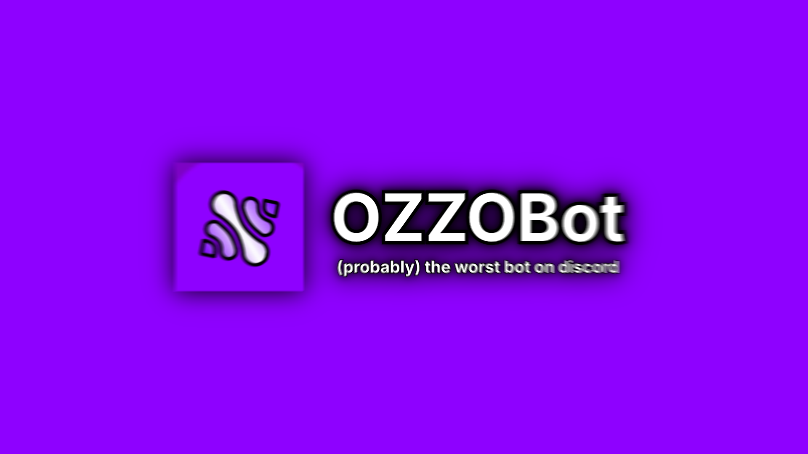

# OZZOBot
A dumb joke bot I made for <a href="discord.gg/M3BCFDx3fF">OZZOYT's Discord Server</a>

# How do I run it?
- Install Python
- Create a bot in the Discord Developer Portal
- Run this command to install the requirements:
```shell
pip install -r requirements.txt
```
(If pip isn't recognized, you may need to add `python3 -m` or `python -m` before the command)
- Create a file called `.env`
- Paste this:
```dotenv
BOT_TOKEN="YOUR_BOT_TOKEN"
```
*Replace "YOUR_BOT_TOKEN" with your bot's token*
- Run the `main.py` file (Read this to learn how)

# How do you run the bot?
It really depends on what Python package manager you use:
### If you use the standard Python package manager:
Type `python main.py` in your terminal!

### If you use uv
Type `uv run main.py` in your terminal!

### B-But I use a different one..
Then google it lol

# How can I give feedback?
You can create an issue, or you can use the `ozzo!feedback` command:
```
ozzo!feedback <message>
```

# How do I contribute?
NO STOP THATS TOO MANY QUESTIONS